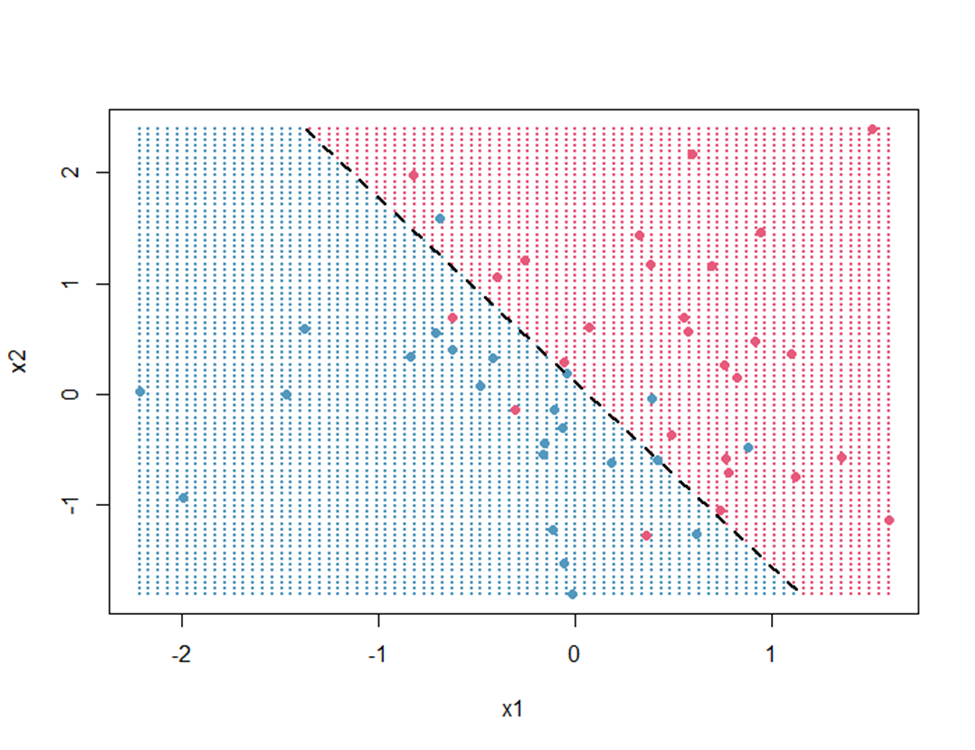

# Written Questions

The following answers are for reference only. They provide general guidance and may not cover all aspects.

Questions:

What are some common pitfalls in model selection?

Answer:

1. **Overfitting**: Choosing a model that is too complex for the data can lead to overfitting, where the model performs well on training data but poorly on unseen data.
2. **Underfitting**: Conversely, selecting a model that is too simple may not capture the underlying patterns in the data, leading to underfitting.
3. **Data Leakage**: Using information from the test set during training can lead to overly optimistic performance estimates.

4. **Ignoring Cross-Validation**: Not using cross-validation can result in a model that does not generalize well to unseen data.

5. **Metric Misalignment**: Choosing evaluation metrics that do not align with the business objectives can lead to suboptimal model selection.

---

Questions:

The following is a decision boundary for a logistic regression. The equation for recall is TP/(TP+FN), the equation for precision is TP/(TP+FP), and the equation for F1 score is (2*precision*recall)/(precision+recall). Provide the precision, recall, and F1 score for the decision boundary:

Answer:

we estimate the classification results using the dashed line as the decision boundary. Here’s how we interpret the scatter plot:

Red dots = Class 1 (positive)

Blue dots = Class 0 (negative)

Region right of the line (shaded red) = Predicted class 1

Region left of the line (shaded blue) = Predicted class 0

By visually counting:

True Positives (TP): Red dots on the red side ≈ 24

False Negatives (FN): Red dots on the blue side ≈ 4

False Positives (FP): Blue dots on the red side ≈ 5

True Negatives (TN): Blue dots on the blue side ≈ 20

Now compute the metrics:

- **Precision** = TP / (TP + FP) = 24 / (24 + 5) = 24 / 29 ≈ 0.8276
- **Recall** = TP / (TP + FN) = 24 / (24 + 4) = 24 / 28 ≈ 0.8571
- **F1 Score** = (2 * Precision * Recall) / (Precision + Recall) = (2 * 0.8276 * 0.8571) / (0.8276 + 0.8571) ≈ 0.8425

---

Questions:

Formulate and explain how hierarchical clustering works.

Answer:

1. **Init**: Start with each point as its own cluster.  
2. **Distance**: Compute all pairwise distances.  
3. **Merge**:  
   - Find the closest pair of clusters.  
   - Merge them.  
   - Update distances using a linkage rule (single, complete, or average).  
4. **Repeat** until one cluster remains.  
5. **Dendrogram**:  
   - Record merge order and distances.  
   - “Cut” at desired height to get k clusters.

---

Questions:

How does K-means know where to start? How does it know when it is done? 

Answer:

1. **Initialization**: K-means can start with random initialization of centroids or use methods like K-means++ to select initial centroids that are far apart from each other.
2. **Convergence**: K-means iteratively updates centroids and reassigns points to clusters until:
   - Centroids do not change significantly (below a threshold).
   - Assignments of points to clusters do not change.
   - A maximum number of iterations is reached.
3. **Stopping Criteria**: The algorithm stops when the centroids stabilize (i.e., the change in centroid positions is below a predefined threshold) or when the maximum number of iterations is reached.
4. **Final Clusters**: The final clusters are determined by the last assignment of points to centroids.

---

Questions:

What problems are more likely to emerge if you do not perform cross-validation in your modelling?

Answer:

- **Overfitting Goes Undetected**  
  You may choose a model that fits noise in your training set and fails on new data.

- **Misleading Performance Estimates**  
  Evaluating only on training (or a single hold‑out) often yields overly optimistic metrics.

- **Poor Model Selection**  
  Without repeated splits, hyperparameter tuning can pick settings that don’t generalize.

- **High Variance & Instability**  
  You won’t see how your model’s performance varies across different subsets of data.

- **Hidden Data Leakage**  
  Cross‑validation helps reveal unintended information flow; skipping it can mask leakage issues.

---

Questions:

For the task of predicting housing prices, which activation functions could you choose for output layer and why (propose more than one option)?

Answer:

1. **Linear Activation**: Suitable for regression tasks like housing prices, as it can output any real number. It allows the model to predict a wide range of values without restrictions.

2. **ReLU (Rectified Linear Unit)**: Can be used if the output is non-negative. It outputs zero for negative inputs and the input itself for positive inputs, which can be useful in certain contexts.

3. **Softplus**: A smooth approximation of ReLU, which outputs positive values. It can be used for regression tasks where non-negativity is required.

4. **Exponential Linear Unit (ELU)**: Similar to ReLU but can output negative values, which can help in learning faster and achieving better performance in some cases.

---

Questions:

Assume we have a set of data from patients who have visited the hospital during the year 2011. A set of features (e.g., temperature, height) have been also extracted for each patient. Our goal is to decide whether a new visiting patient has any of diabetes, heart disease, or Alzheimer (a patient can have one or more of these diseases).

We have decided to use a neural network to solve this problem. We have two choices: either to train a separate neural network for each of the diseases or to train a single neural network with one output neuron for each disease, but with a shared hidden layer. Which method do you prefer? Justify your answer.

Answer:

I’d train a single multitask network with one output per disease and shared hidden layers—this lets the model learn common patterns (e.g. age, BMI effects) across all three conditions, improves data efficiency, and regularizes each task via inductive transfer, whereas separate nets miss these shared structures and risk overfitting.

---

Questions:

Suppose you have two training examples (x⁽¹⁾,y⁽¹⁾) and (x⁽²⁾,y⁽²⁾). A correct sequence of operations for computing the gradient in the back propagation algorithm is (Let FP = forward propagation, BP = back propagation). Forward propagation (FP) using x⁽¹⁾ followed by FP using x⁽²⁾. Then, back propagation, BP, using y⁽¹⁾ followed by BP using y⁽²⁾. True or false? Explain your answer.

Answer:

False. Reverse‑mode backpropagation must undo the forward passes in reverse order, so after

FP(x¹); FP(x²)

you need to do

BP(y²); BP(y¹)

or, more simply, pair each forward with its backward pass (FP→BP for x¹, then FP→BP for x²)—otherwise you either overwrite needed activations or break the required reverse traversal of operations.

---

Questions:

Assume we have a set of data from patients who have visited the hospital during the year 2011. A set of features (e.g., temperature, height) have been also extracted for each patient. Our goal is to decide whether a new visiting patient has any of diabetes, heart disease, or Alzheimer (a patient can have one or more of these diseases).

Some patient features are expensive to collect (e.g., brain scans) whereas others are not (e.g., temperature). Therefore, we have decided to first ask our classification algorithm to predict whether a patient has a disease, and if the classifier is 80% confident that the patient has a disease, then we will do additional examinations to collect additional patient features In this case, which classification methods do you recommend: neural networks, decision tree, or support vector machine? Justify your answer in 1-2 sentences.

Answer:

I recommend using a decision tree for this task. Decision trees are interpretable and can easily provide confidence scores for their predictions, making them suitable for scenarios where we need to assess the certainty of a classification before deciding on further expensive examinations.