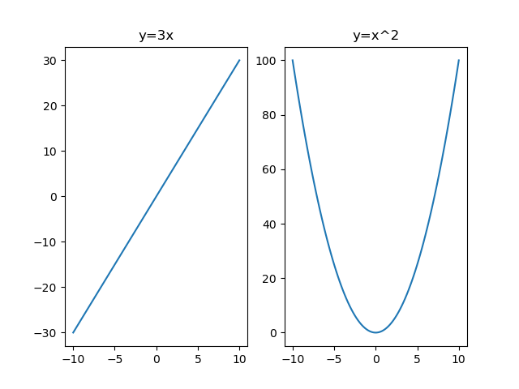

# Week 02

Let us start with the basics of Python programming and NumPy library to perform matrix operations.

## Matrix Operations with NumPy

### Creating Matrices

```python
import numpy as np

# Create a 2x2 matrix
matrix = np.array([[1, 2], [3, 4]])
print("Matrix:")
print(matrix)
```

### Matrix Addition

```python
# Define two matrices
matrix1 = np.array([[1, 2], [3, 4]])
matrix2 = np.array([[5, 6], [7, 8]])

# Add matrices
result = matrix1 + matrix2
print("Matrix Addition:")
print(result)
```

### Matrix Multiplication

```python
# Multiply matrices
result = np.dot(matrix1, matrix2)
print("Matrix Multiplication:")
print(result)
```

### Transpose

```python
# Transpose a matrix
transposed = matrix1.T
print("Original Matrix:")
print(matrix1)
print("Transposed Matrix:")
print(transposed)
```

### Determinant

```python
# Calculate the determinant of a matrix
determinant = np.linalg.det(matrix1)
print("Original Matrix:")
print(matrix1)
print("Determinant of matrix1:")
print(determinant)
```

### Inverse

```python
# Calculate the inverse of a matrix
inverse = np.linalg.inv(matrix1)
print("Original Matrix:")
print(matrix1)
print("Inverse of matrix1:")
print(inverse)
print("Product of matrix1 and its inverse:")
print(np.dot(matrix1, inverse))
```

### Adjoint

```python
# Calculate the adjoint of a matrix
adjoint = np.linalg.inv(matrix1) * determinant
print('Original Matrix:')
print(matrix1)
print("Adjoint of matrix1:")
print(adjoint)
```

## Brief Introduction to Gradients (or Derivatives)

In many machine learning algorithms, particularly in optimization methods like **Gradient Descent**, we update model parameters using the gradient of a cost function. A common update rule is:

$$
\theta_{\text{new}} = \theta_{\text{old}} - \eta \cdot \nabla J(\theta)
$$

where:

- $\theta$ represents the model parameters.
- $\eta$ is the learning rate.
- $\nabla J(\theta)$ is the gradient of the cost function $J$ with respect to $\theta$.

The gradient tells us the direction in which the cost function increases the fastest. By moving in the opposite direction (the negative gradient), we can minimize the cost.

### Gradients as Mathematical Derivatives

The gradient $\nabla J(\theta)$ is fundamentally a collection of derivatives. In mathematics:

For a single-variable function $f(x)$, the derivative is defined as:

$$
f'(x) = \lim_{h \to 0} \frac{f(x+h) - f(x)}{h}
$$

It measures how much $f(x)$ changes with a small change ($h$) in $x$. In the graph, the derivative represents the slope of the tangent line to the curve at a point.

For a multi-variable function, the gradient is a vector composed of all the partial derivatives:

$$
\nabla f = \left( \frac{\partial f}{\partial x_1}, \frac{\partial f}{\partial x_2}, \dots \right)
$$

Thus, in machine learning, when we refer to the gradient, we are essentially referring to the mathematical derivatives that capture the rate of change of a function.

### A Simple Example: Single-Variable Function

Consider a basic example with a single-variable function:

$$
f(x) = 3x
$$

The derivative of this function is: $ f'(x) = 3$. This means that for every unit increase in $x$, $f(x)$ increases by 3 units. In the graph, this is represented by a straight line with a slope of 3. There is no maximum or minimum in this case, as the function is linear.

Now, consider a quadratic function:

$$
f(x) = x^2
$$

The derivative of this function is:

$$
f'(x) = 2x
$$

- This derivative is dependent on $x$.

- At $x = 2$:
  The derivative is $f'(2) = 4$. This means that around $x = 2$, a small increase in $x$ will increase $f(x)$ at a rate of 4 units per unit change in $x$.
- You can check this by hand: $f(2) = 4$, while $f(2.1) = 4.41$. The difference is $0.41$, which is approximately $0.4$ times the change in $x$ ($0.1$). This increase is a little more than $4$ times the change in $x$, which is expected since we are at $x = 2$ where the function is increasing rapidly (slpoe of the curve is steeper when $x$ is larger).

You can run the following code to visualize the function and its derivative:

```python
import matplotlib.pyplot as plt  # type: ignore
import numpy as np # type: ignore
# plot two graphs: left y=3x, right y=x^2

x = np.linspace(-10, 10, 100)
y1 = 3 * x
y2 = x ** 2
fig, (ax1, ax2) = plt.subplots(1, 2)
ax1.plot(x, y1)
ax2.plot(x, y2)
ax1.set_title('y=3x')
ax2.set_title('y=x^2')
plt.show()

# save it to a png file
fig.savefig('plot.png')
```

You will get the following figure:


### Application in Algorithms

In the context of gradient-based algorithms, this derivative provides the information needed to adjust the parameter $x$ in order to minimize $f(x)$. For example, using gradient descent:

$$
x_{\text{new}} = x_{\text{old}} - \eta \cdot f'(x_{\text{old}})
$$

- If $x = 2$ and the learning rate $\eta$ is 0.1, then:

$$
x_{\text{new}} = 2 - 0.1 \times 4 = 2 - 0.4 = 1.6
$$

This update rule shows how the derivative informs us about the change in $x$ required to reduce the value of $f(x)$.


From the figure above, we can see that the algorithm will **adjust the parameter $x$ in the direction** that reduces the function value, ultimately converging to the minimum.

Here is a simple implementation of gradient descent in Python:

```python
# Using gradient descent to find the minimum of f(x) = x^2

def f(x):
  return x**2

# the gradient of f(x) can be conveniently calculated as:
def grad_f(x):
  return 2 * x

# Set an initial guess for x, learning rate, and convergence criteria
x = 10.0  # initial value
learning_rate = 0.1 # learning rate
max_iter = 50
tolerance = 1e-6

print("Iteration\t   x\t          f(x)\t           Gradient")
for i in range(max_iter):
  gradient = grad_f(x)
  print(f"{i+1:9d}\t {x:7.6f}\t {f(x):7.6f}\t {gradient:9.6f}")
  # Update x using gradient descent rule
  x_new = x - learning_rate * gradient
  if abs(x_new - x) < tolerance:
    x = x_new
    break
  x = x_new

print("\nConverged: x =", x, "with f(x) =", f(x))
```

### Conclusion

Gradients in machine learning are essentially the mathematical derivatives that measure the rate of change of a function. By understanding this connection and using simple examples such as the derivative of $f(x) = x^2$, we can better appreciate how gradient-based methods guide parameter updates to optimize model performance
